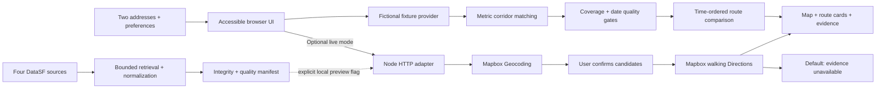

# Architecture and trust boundaries

Sidewalk separates the experience that can be verified today from external services and data that require additional validation. The runnable V1 has two paths, with a hard boundary between their evidence.

## Why this stack

The demo is dependency-free browser JavaScript, semantic HTML, CSS, and SVG. A single Node service supplies the optional live adapters and static files. The computation runs identically in Node tests and the browser. A framework, database, and language model would not improve the current bounded workflow enough to justify extra operational state. This choice also makes a portfolio reviewer’s first run trivial.

The production prototype does not call OpenAI. AI helped create the project; it does not infer concerns, generate route evidence, or decide safety. Astra model availability is independent of running this project in Work/Codex or locally.

## Domain contracts

Route: stable ID, label, duration in seconds, distance in metres, and an ordered `[longitude, latitude]` line. Provider order is explicitly sorted by duration; ties retain order. Optional alternatives remain optional.

Evidence: source kind, stable source entity ID, event date, approximate coordinate, source-specific observation windows, refresh and retrieval dates, completeness flag, and explicit fictional provenance. The demo flags are not a general-purpose live import API. `compareJourney` refuses evidence on the live path even if a caller accidentally attaches a fixture.

Result: route time/distance; extra minutes from fastest; detour eligibility; separate source counts or `null`; matched sample IDs and segments; shared records with the baseline; screening sensitivity; quality status. There is no scalar safety result.

## Geographic method

For SF-scale walks, a local equirectangular projection uses mean latitude for point-to-point distance and the record latitude for point-to-segment distance. The closest point is clamped to the segment ends. Every segment is examined; counting near route vertices alone would miss mid-block observations. An event is counted at most once per route using `(source kind, event ID)`, even at a shared vertex or overlapping segment.

The default 50 m corridor is an illustrative screening choice, not a danger radius. Users can inspect 25/50/100 m sensitivity. These tolerances have **not** been validated for real SFPD intersection displacement. A production evidence pipeline should use a tested geospatial library or PostGIS with geodesic distances and an SF boundary, and validate alignment against independent GIS checks.

The demo complexity is O(routes × records × segments), intentionally adequate for 12 evidence records. A citywide production scan in the browser is inappropriate. Query a bounded route envelope, index real data spatially, and send aggregate context rather than raw sensitive narratives.

## Comparison and withholding rules

1. Validate route shape, duration, distance, IDs, buffer, and detour values.
2. Require explicit demo provenance and complete coverage before computing demo numbers.
3. Validate date ordering: observation start ≤ end ≤ refresh ≤ retrieval ≤ assessment date.
4. Withhold the demo snapshot if its refresh age exceeds 120 days. This is a demonstrative product threshold, not a universal standard for SF data.
5. Filter collision records by the fixed collision window; filter reports by an inclusive 3/6/12-calendar-month event-date window (default six). Clamp invalid month-end cutoffs. Require the full requested incident window to lie within declared incident coverage; withhold only report counts when it does not. Validate coordinates and deduplicate each source entity.
6. Preserve duration ordering; show alternatives beyond the budget, labeled clearly.
7. Describe the first eligible alternative with fewer sample collision records. This never ranks individual risk. Crime/report counts do not pick a winner.
8. Missing, stale, invalid, or disconnected evidence produces `null` counts, not zero.

If a valid complete sample contains zero matching records, the UI says that this does not establish absence of concerns. A single provider route is valid and receives no invented alternatives.

## Live integration

`GET /api/config` reports provider configuration and exposes only the Mapbox public token required by GL. `POST /api/geocode` uses Geocoding v6, explicit address type, US country, SF bounding envelope, no autocomplete, and returns at most five candidates. The user confirms both candidates. `POST /api/routes` calls the walking profile with `alternatives=true`, GeoJSON, and full geometry. With usable evidence, `lib/route-options.mjs` probes up to twelve paths, in batches of four, around report blocks and crash clusters as well as nearby streets. Without evidence, up to six nearby-street probes supplement insufficient native alternatives. See the search contract below. The service filters malformed and out-of-envelope routes, bad endpoint snaps, near-duplicates and obvious loops.

Input bodies are limited to 8 KiB. Endpoints validate coordinates, separate origins/destinations, and text length. Geocoding and the initial route call have a 10-second upstream timeout; each waypoint probe has 6.5 seconds, and the browser allows 45 seconds overall. Errors redact upstream payloads. A small 30-unit/minute per-IP limiter reserves thirteen units per route request and one per geocode, bounding the worst-case provider fan-out. This limiter is appropriate for a local prototype, **not** a distributed public abuse control. Deployments behind proxies need platform rate limits, quota controls, and trusted proxy handling.

Mapbox temporary results remain in memory; API responses use `no-store`; the app does not persist or export live geocoding/directions. No server address/request logs are emitted. Hosting/provider logs must be configured separately. Theme and introduction-dismissal preferences persist. Optional saved trips contain a strict allowlist of user-entered addresses, preferences and public evidence dates; no live provider output is retained.

## Deployment boundaries

A static deployment would have no live server adapter and need no credentials. No public deployment has been completed. The same `dist/` code can run with the Node server. The source audit is a separate, manually run read-only tool, not a background job. There are no accounts, database, analytics service, location permissions, or hidden scheduled tasks.

Before public live operation: verify token scope/referrer behavior, host request-log policy and retention, distributed rate limits, provider quotas, CSP, browser error reporting without addresses, and the launch gates in `VALIDATION.md`. None of these deployment controls substitutes for the missing real-data validation.

## Independent facility and time-window layers

`facilities.mjs` matches current/former public-housing, halfway-house and residential-reentry listings to the selected route at 50/150/300 m. The server loads `assets/sf-facilities-reviewed.json` and attaches an independently validated directory to `/api/routes`; it never passes facilities into route search or evidence analysis. The client validates again, filters by type and nearest-segment distance, and renders keyboard-accessible Mapbox marker buttons and matching detail cards. Sample/live provenance must match exactly. Source URLs, public address, review dates and approximate Census/City representative positioning are shown in the dialog. Coverage is always partial for real listings. Duplicate IDs, invalid coordinates, missing sources, malformed/future review dates or an unreviewed status withhold the directory. Expired records are suppressed individually; an entirely expired directory is unavailable. Client checks run on rendering and across date changes/resuming a tab. Review dates are capped at 90 days; this maintenance policy does not establish present operating conditions. Only explicit public-place fields are serialized. Distances are approximate point-to-route proximity, not property boundaries, entrances or walking distance.

The reviewed expansion has four independent categories and an optional citywide viewing scope. Scope changes only marker/list filtering; near-route distances and all route/evidence results are unchanged. Counts by category are computed after expired entries are withheld. City source rows and approved mappings are retained in the facility audit, including a merged duplicate address. The browser presents a bounded scrollable listing alongside map pins so overlapping points remain inspectable. Facility pins use a 10–22 px graphic inside a stable 24 × 32 px button. A single map zoom listener updates inherited CSS size variables; markers are not rebuilt on zoom and Mapbox retains control of geographic placement. Bottom anchoring keeps the tip at the address. Category initials appear at 16 px and larger; overview pins use a dot. Focus/hover enlargement affects the graphic only. The fictional SVG uses the same pin artwork, and all details remain available in the list. See [FACILITY_COVERAGE.md](FACILITY_COVERAGE.md).

`incidentWindow` and `incidentCoverageStatus` define time filtering in the shared analysis module. Route cards, purple bands, detailed findings, corridor sensitivity and JSON exports all derive from the same filtered matches. A partial incident snapshot preserves valid collision counts and uses `null` for reports. The demo's coverage flag is a fixture contract, not a claim that real police reporting can ever be exhaustive.

Real ingestion now implements per-source manifests and source-specific freshness gates; complete retrieval and a second computational spatial check now pass. Human source/domain validation is still outstanding. See [LIVE_DATA_PLAN.md](LIVE_DATA_PLAN.md). No background ingest or refresh job is running.

## Gated real-evidence path

`lib/socrata.mjs` reads publisher schemas and count/distinct-key totals, retrieves bounded ordered pages, checks every key, then requires unchanged source-update metadata and column schema. Requests are paced and have a 45-second timeout. Full source replacement reconciles backdated edits and deletions. It does not certify exhaustive reporting or eliminate every possible publisher/cache race.

`lib/normalize-evidence.mjs` collapses selected police code rows by `incident_id`, validates categories against `ci9u-8awy`, and retains initial report types only. One report may contain both Assault and Robbery categories. Null/invalid/out-of-envelope locations are excluded and counted, never converted to `[0,0]`; conflicting entities and unknown taxonomy fail the source's usability gate. The supported envelope is not an administrative boundary.

Pedestrian-involved crashes are selected by joining `ubvf-ztfx` to **all** Pedestrian party records in `8gtc-pjc6` using `case_id_pkey`. Looking only at the first two parties would miss some crashes. Group-category disagreements and missing join counterparts are tallied. These are injury crashes involving a pedestrian, not necessarily crashes where the pedestrian was injured.

`lib/live-evidence.mjs` validates SHA-256 integrity, provenance, dates, coordinates and uniqueness. SHA-256 detects accidental content changes; it is not publisher authentication. Each source can become unavailable independently. Police retrieval and source-update ages must be no more than three days; crash retrieval must be within 14 days and its quarterly publisher update within 120 days. These are conservative prototype policies, not source guarantees. Event windows remain visible and are not implied by those refresh dates.

`LIVE_EVIDENCE_PREVIEW=1` explicitly loads the local snapshot at server start. With it disabled, absent or invalid data yields no evidence. `liveContext` returns only crashes within 100 m of any route, plus aggregated official Census block polygons for each date window. Police point coordinates and report identifiers are not returned; cell polygons, counts, bins and category aggregates are returned. The browser's separate `attachLiveContext` path preserves time ordering and can identify a geometric area bypass without making a safety recommendation. There is no citywide police payload in the browser.

The local preview is enabled after successful full retrieval and mechanical checks. Public release remains on hold. The independent geometry check in `geometry-validation.json` uses 1,050 constructed test points across ten actual Mapbox lines; it does **not** validate real event attribution. It found a maximum 0.4384 m difference against projected Shapely distances and no corridor disagreement farther than 0.5 m from a threshold. Source placement uncertainty is much larger; counts near a threshold can differ.

The real-record follow-up in `real-attribution-validation.json` checked 12,780 crash/route pairs across ten actual walking lines. All thirty 25/50/100 m counts matched the independent projected calculation; the maximum nearby distance difference was 0.4363 m. `publisher-reconciliation.json` independently matches mapped source entity totals (7,147 selected reports; 1,278 pedestrian-involved crashes). These computational checks do not replace human domain review or field verification.

Connection troubleshooting: explicit fresh HTTP connections resolved the observed HTTP 428 failures during subsequent complete refreshes. A lower-case category spelling in the official crosswalk initially failed the taxonomy gate; case normalization resolved it without changing accepted categories or weakening unknown-code checks. The underlying network error cause was not independently proven.

## Bounded evidence-guided walking search

The native walking request uses full GeoJSON, steps and `alternatives=true`. The provider does not guarantee multiple alternatives or support arbitrary avoidance polygons for walking. `route-guidance.mjs` therefore creates waypoint probes around the darkest blocks encountered by the baseline and clusters of nearby historical crashes. Generic street probes expand the candidate set. These are search targets only: every displayed line, distance and duration is returned by Mapbox and measured afterward. No straight-line waypoint connector is shown as a walk.

The server uses the selected 3/6/12-month report window and 25/50/100 m crash corridor. Missing, stale or partial evidence disables only its corresponding objective; missing block boundaries also disable report guidance. Up to twelve probes run in batches of four, including when the native provider already returned three routes. Without usable evidence, the generic search is capped at six probes. Waypoint snapping is capped at 65 m, endpoints at 100 m, and coordinates must remain in the SF envelope. The search is bounded and may miss useful alternatives.

Candidates are sampled at ≤30 m intervals for geometric distinctness. The greater directional length beyond 35 m from another line must reach both 12% and a 70–200 m minimum based on route length. Repeated-edge and vertex checks reject obvious loops; they do not prove optimality. Time is capped at baseline + max(10, selected detour + 5) minutes and distance at baseline × 1.8 + 250 m.

`route-metrics.mjs` keeps two descriptive measures separate: approximate walking length alongside blocks with 30+ selected reports, and distinct mapped pedestrian-involved crashes within the chosen corridor. Report length uses a 15 m boundary margin for street-centerline walks, sampled at ≤10 m intervals, and a second 50 m margin for sensitivity. A report-overlap improvement must reduce both lengths by at least 100 m. A crash improvement requires at least one fewer record. These thresholds are product heuristics, not validated harm reductions. There is no combined score or count/km risk rate.

The fastest found candidate stays as the reference. Selection favors within-budget reductions for each objective, measures candidates before geometric deduplication, and retains up to three distinct paths in time order. Additional guided options must improve at least one measure; the app never pads the result with irrelevant detours. A reduction in one measure can increase the other, and both are displayed. Beyond-budget options remain explicitly labeled. Failed probes preserve successes and surface a partial-search notice.

The browser recomputes metrics for the selected window/corridor. If those settings or the detour limit change, the existing options are labeled as needing an update. Update alternatives reruns the bounded search with the confirmed endpoints held in page memory. Requests are versioned so an older response cannot overwrite a newer search.

## Street-block report geography and bypasses

`assets/sf-blocks-2020.json` bundles geometry and identifiers from DataSF `e2st-aufe`, Census 2020 blocks clipped to the shoreline. No demographic attributes enter the app. Blocks generally follow streets but can follow parks, water, railway or legal boundaries; the vintage does not promise the current sidewalk layout. The refresh reconciles all 5,954 source rows, retains 5,950 intersecting the supported envelope, and excludes four offshore rows. Source GEOIDs are normalized with their missing leading zero.

`ingest-blocks.mjs` requires stable source reconciliation and basic geometry checks, then calls `validate-blocks.py`. GEOS found three self-intersecting source geometries; `make_valid` repairs them, preserving polygon parts and recording each change. All retained polygons then validate. Python with Shapely 2 is needed only for this optional refresh. The static boundary bundle has a SHA-256 integrity check; failure withholds report shading/guidance instead of substituting a square grid.

`block-evidence.mjs` uses a server-side spatial bucket index to associate each report with every polygon containing its published point or within 35 m. Polygon holes and multipolygons are supported. A report is deduplicated within each block, but can appear beside several blocks at a shared intersection. The aggregate unique-report total is the union, not the sum of block counts; category counts may also overlap. SFPD masking prevents attribution to a building or sidewalk. The 35 m margin is a display choice, not a validated uncertainty bound.

Whole blocks intersecting the common journey bounds plus 500 m are displayed. Each count uses the whole block's proximity area; it does not change when the journey clips another part of that same block. Inclusive event-date filtering and fixed legend bins (1–4, 5–14, 15–29, 30+) apply across views. Different-duration raw totals are not trend estimates, and darkness is not normalized by block size, pedestrian volumes or reporting behavior.

`block-geometry.mjs` computes polygon proximity and union route overlap so neighboring blocks do not double-count line length. Approximate overlap is rounded to about 50 m for display. Bypass eligibility uses exact segment intersection/distance checks against a 50 m block margin, including tiny crossings; unknown geometry cannot produce a bypass. All displayed blocks are also inspectable in an accessible selector. Stale/partial reports emit no polygons independently of crash availability.

An independent GEOS/Shapely calculation matched all block counts for the 3,719 six-month mapped reports: 2,946 nonempty blocks, zero unmatched reports, zero count disagreements. This tests implementation consistency, not the true location or meaning of a report. Aggregate audits are in `block-boundary-validation.json` and `block-attribution-validation.json`.

## Multiple-area selection and category coverage

The current report allowlist is shared in `dist/lib/report-scope.mjs`: Assault, Robbery, Homicide, Rape and Sex Offense. Ingestion selects these exact publisher categories and validates each source code against the official crosswalk before enabling the layer. The manifest records which categories were actually retrieved. Older valid snapshots can declare a reviewed subset; the browser lists that subset instead of claiming broader coverage. These five categories are not a UCR violent-crime definition. No severity weighting is introduced.

Map taps toggle independent selected polygons, with up to 100 selected at once. Popups, selector options and removable selection chips use counts and date ranges instead of numbered block labels. Changing route selection or theme preserves the area selection; a new journey clears it. A changed report window retains only areas represented in that window, recomputes the combined total, and discards obsolete responses. The existing route search remains a separate action; selection compares available bypasses but does not automatically generate new routes.

For multiple areas, `POST /api/report-selection` accepts only supported block IDs, the report window and the expected snapshot date/retrieval timestamp. IDs are unique and bounded, bodies remain limited to 8 KiB, unknown IDs and snapshot mismatches fail explicitly, and source freshness/coverage is checked again. A separate 120-request/minute local limit prevents selection clicks from consuming the provider-call budget. This endpoint needs no Mapbox call or new credentials. Responses are non-cacheable aggregates with no police IDs or coordinates.

`selectedBlockReports` unions matching reports by source identity before counting categories; one report can still contribute to multiple category totals. The client debounces requests, guards responses by selection/window/snapshot identity and shows unavailable counts on failure, never a sum or a fabricated zero. Single-area totals use the already-validated map aggregate. Available bypass routes must clear the 50 m margin around **every** selected area. Missing geometry fails closed.

The map prominently states that public records are partial, including withheld confidential and juvenile reports. Homicide is specifically known to be undercounted. No claim of a complete rape, homicide or all-crime inventory is made; official aggregate crime statistics cannot be apportioned to a route.

## Map workspace, directions and saved trips — October 8, 2026

The UI uses accessible Map / About the data tabs with roving keyboard focus and a hidden inactive panel. Map retains changing source state, date windows and fictional/live labels. The planner, route options, map layers and walking steps have native collapsible controls. Choosing a walk renders only that route; returning to comparison restores every option without a new provider request. Mapbox resizes after returning from the data panel.

`lib/walking-steps.mjs` validates every step across every provider leg before retaining ordered instructions in the route object. Missing/incomplete/malformed legs withhold the whole instruction list. The client escapes instruction text. Intermediate `arrive` maneuvers on waypoint legs are shown as intermediate routing points; the final leg retains its arrival instruction. These steps stay in memory; there is no live tracking, turn matching, voice guidance, offline map cache or automatic reroute.

`dist/lib/walk-plans.mjs` owns the versioned storage contract. `sidewalk-saved-walks-v1` holds at most 20 validated records. A live record permits only typed endpoints, up to three handoff stop addresses, departure note, report window, corridor/detour preferences and public evidence date metadata. Validation reconstructs an allowlisted object, stripping injected provider fields. Fictional records separately retain invented routes, selected ID and demo scenario. IDs, coordinates, bounded text, dates, preferences and route selection are checked; corrupt/unsupported records and quota/disabled-storage failures are visible to the user. Addresses remain local until the user requests geocoding or opens an external Maps link.

Loading a live trip only fills the planner. The user confirms new geocoding matches and obtains a new route comparison; it cannot masquerade as the old exact path. Loading a sample restores its invented route. No account or cloud synchronization is involved.

Handoff URL builders use only entered origin/destination strings and up to three ordered stop strings in walking mode, encoded with URLSearchParams. They do not copy temporary geocodes, route waypoints, instructions or geometry. Handoff is disabled for samples, and links disclose recalculation before opening. Current Mapbox Product Terms (July 21, 2026), §2.10.1, prohibit storage/export of Navigation API results; §2.7.2 covers Temporary Geocodes. See DATA_SOURCES.md for current official links. Obtaining permanent geocoding alone is insufficient for exact-route persistence.

Handoff adds a San Francisco city hint to typed addresses that do not already include SF or San Francisco. This uses static city context, not provider geocodes. Users must check the external app’s address matches.

The stop editor accepts up to three independent typed addresses/intersections, preserves their order, and never fills them from provider route output. Google receives one pipe-separated `waypoints` parameter; Apple receives repeated `waypoint` parameters. Blank entries are omitted. Invalid inputs, extra stops, delimiter injection and URLs above Google's 2,048-character cap are rejected visibly rather than silently truncating a trip. Editing stops only changes the handoff link and optional local save, not route geometry, counts or evidence claims. Editing the starting/destination address clears previous handoff stops. The existing no-stop storage format remains valid.

## Protected hosting runtime

The Render configuration adds HTTP Basic access protection (except a minimal health endpoint), bounded provider budgets, configured proxy handling, restrictive response headers and a persistent evidence directory. An hourly timer checks whether a daily refresh is due, runs ingestion and independent reconciliation in a bounded child process, validates the candidate, and promotes it atomically. A snapshot provider pins the current in-memory snapshot at the start of each API request. Source failures preserve the previous snapshot; freshness checks still suppress stale layers. This single-instance design is intentional for a protected pilot. See DEPLOYMENT.md for constraints and operational procedures.
